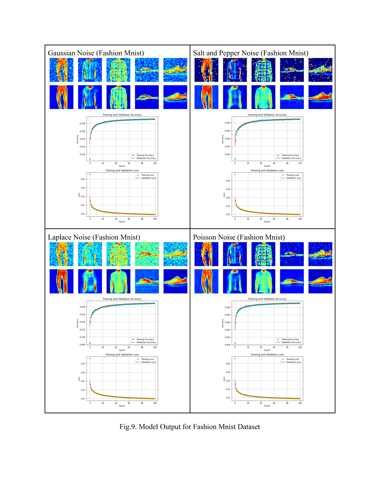

# XAI Driven Image Denoising Visualization Using Activation Maps
## Co-workers: [Md Ridwan Hasan](mdridwan@ualberta.ca), [Tingyang Jiao](tingyang@ualberta.ca), [Pengcheng Yan](py@ualberta.ca)

## Our group’s purpose in this project is to visualize and analyze the performance of an existing denoising model using XAI techniques like activation maps on different types of image datasets with different types of noises and compare the performances.

### In the fifth section, we set experiments with an autoencoder algorithm from [Rahul Raj Pandey](https://github.com/Rahulraj31/Autoencoder_MNIST-Fashion).

### The model achieves an accuracy of ~81% for the Mnist dataset, which is a set of much simpler images compared to an accuracy of ~50% for the Fashion Mnist dataset that consists of more complex images.
### While denoising the Fashion Mnist images, the network removes some original image features by identifying them as noises since the noise and feature pixels lie on top of each other. This explains why the network's performance is lower for the Fashion Mnist dataset compared to the Mnist dataset. In Fig.11, we can see that for much simpler Mnist images, the model identifies the noisy pixels much better and preserves the original feature of the images relatively well, which is why the prediction accuracy is also higher in this case. Our primary focus in this project is not to improve the accuracy of the model for denoising since there are a lot of denoising models that achieve very high accuracy but to show how we can use visualization maps or class activation feature maps to better understand and interpret the output of the model.

### In this project, we demonstrated how visualization techniques could be used to understand better the underlying mechanisms and decision process of a denoising algorithm like an autoencoder. Using the visualization, we can determine how different images and noises affect the model’s performance. In future, we plan to use similar visualization techniques on more advanced denoising algorithms and come up with some way to use this information to enhance the model’s performance. Another future extension of our current work can be visualizing a deep neural network for image segmentation and classification.
